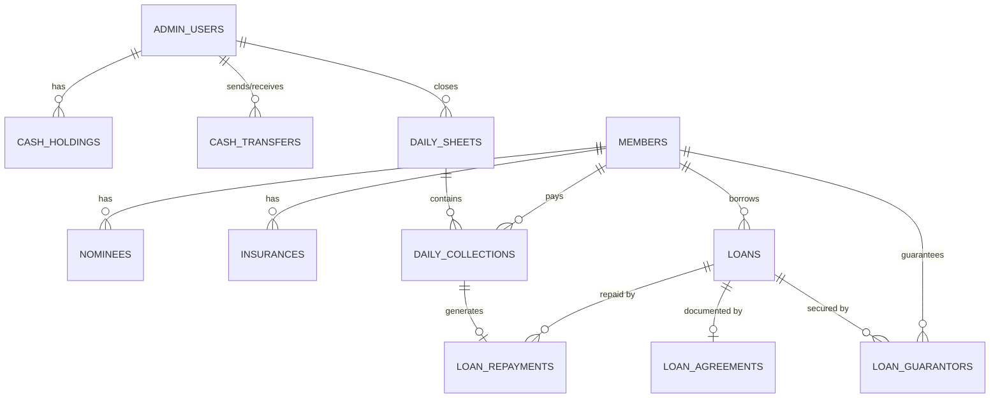

# VANIGAR SANGAM — PHASE 0 ARCHITECTURE REPORT

**Project:** Vanigar Sangam Association Management & Financial Operations System  
**Phase:** Phase 0 — Project Planning, Requirement Freeze & Architecture  
**Status:** Frozen & Approved for Architecture Sign-Off  
**Date:** October 3, 2026  

---

## 1. Project Understanding

**Vanigar Sangam** is a real-world financial operations and association management system designed for a commercial traders' association (*Vanigar Sangam*). The application automates and digitizes daily member collection workflows, member sheet subscriptions, loan lifecycle processing, guarantor responsibility tracking, cash holding & physical cash transfers between association administrators, printable financial receipts/agreements, and comprehensive audit logs.

---

## 2. Repository Audit

The workspace has been completely audited. The project is structured as a **modular monorepo** managed via **npm workspaces**.

```text
vanigar sangam for antigravity/
├── apps/
│   ├── api/             # REST API server (Node.js + Express 5 + TypeScript)
│   └── web/             # Next.js 16 (App Router) + React 19 + TypeScript UI
├── packages/
│   ├── config/          # Centralized env reader (@vanigar/config)
│   ├── rules/           # Pure business rule engine (@vanigar/rules)
│   ├── shared-types/    # Shared TypeScript contracts & DTOs (@vanigar/shared-types)
│   └── validation/      # Structural validation utilities (@vanigar/validation)
├── database/            # Database migrations, seeds, and schema docs
├── docs/                # Architecture, database, and development documentation
├── scripts/             # Development & maintenance helper scripts (clean.mjs)
├── tests/               # Cross-application integration / E2E test suite (reserved)
├── .env.example         # Environment template file
├── eslint.config.mjs    # Monorepo ESLint flat configuration
├── package.json         # Workspace root manifest
├── package-lock.json    # Dependency lockfile (v3)
├── tsconfig.json        # Composite TypeScript project configuration
├── tsconfig.base.json   # Base TypeScript compiler options
└── README.md            # Repository overview & setup guide
```

---

## 3. Technology Stack

The exact versions inspected from the host environment and package manifests are:

| Layer / Tool | Technology / Package | Exact Version | Verification Source |
| :--- | :--- | :--- | :--- |
| **Runtime Environment** | Node.js | `v24.13.1` (Engine specified: `>=20.12.0`) | `node -v` |
| **Package Manager** | npm | `11.8.0` | `npm -v` |
| **Language** | TypeScript | `5.9.3` | `package.json` |
| **Frontend Framework** | Next.js | `16.3.8` (App Router, Turbopack) | `apps/web/package.json` |
| **UI Library** | React / React DOM | `19.2.8` | `apps/web/package.json` |
| **Backend Framework** | Express | `5.2.1` | `apps/api/package.json` |
| **Database Server** | PostgreSQL | Version `18.0` (Service: `postgresql-x64-18` running) | Windows Service Manager |
| **Linter / Formatter** | ESLint / Prettier | ESLint `9.39.5` / Prettier `3.9.9` | Root `package.json` |
| **TypeScript Execution** | `tsx` | `4.23.15` | `apps/api/package.json` |
| **VCS** | Git | `2.54.0.windows.1` | `git --version` |

---

## 4. Dependency Audit

### Package Manifest Analysis:
1. **Root `package.json`**:
   - Workspaces: `apps/*`, `packages/*`.
   - Scripts: `build`, `build:ts`, `build:web`, `dev:api`, `dev:web`, `start:api`, `typecheck`, `lint`, `lint:fix`, `format`, `format:check`, `clean`.
2. **`apps/api/package.json`**:
   - Dependencies: `@vanigar/config`, `express` (`^5.2.1`).
   - Dev Dependencies: `@types/express` (`^5.0.6`), `tsx` (`^4.23.15`), `typescript` (`5.9.3`).
3. **`apps/web/package.json`**:
   - Dependencies: `next` (`16.3.8`), `react` (`19.2.8`), `react-dom` (`19.2.8`).
   - Dev Dependencies: `@types/node`, `@types/react`, `@types/react-dom`, `eslint`, `eslint-config-next`, `typescript`.
4. **Internal Packages (`@vanigar/*`)**:
   - All use ESM (`"type": "module"`), TS project references, and export clean `.d.ts` declaration maps.

### Compatibility Risks & Findings:
- Express 5.2.1 is installed in `apps/api`. Promise rejections in route handlers are automatically handled, which is cleaner than Express 4.
- Node `process.loadEnvFile()` is used natively in `@vanigar/config`, avoiding third-party `dotenv` dependencies.
- No database driver (e.g., `pg` / `pnpm` / `knex` / `drizzle` / `prisma`) is installed yet. Database driver selection will be finalized in Phase 1 / Phase 3.

---

## 5. Current Git State

- **Status:** Uninitialized inside current working directory (`fatal: not a git repository`).
- **Working Tree:** All workspace files were successfully placed and verified.
- **Phase 1 Action:** `git init` will be executed during Phase 1 repository setup, followed by an initial baseline commit.

---

## 6. Existing Architecture

The codebase currently implements **Phase 1.1 — Monorepo Foundation**:
- `@vanigar/config`: Implements environment variable loaders (`loadLocalEnv`, `readEnv`, `requireEnv`, `readIntEnv`).
- `@vanigar/rules`: Package boundary defined (`RULES_PACKAGE_NAME`). Business rules are NOT yet implemented.
- `@vanigar/shared-types`: Package boundary defined (`SHARED_TYPES_PACKAGE_NAME`).
- `@vanigar/validation`: Package boundary defined (`VALIDATION_PACKAGE_NAME`).
- `@vanigar/api`: Minimal Express server with `/health` endpoint listening on port `4000`.
- `@vanigar/web`: Minimal Next.js root page (`app/page.tsx`) with an API client utility (`lib/api/client.ts`).

---

## 7. Target Architecture

The target system architecture is a **Modular Monorepo Monolith**:

```text
                      ┌─────────────────────────┐
                      │    Next.js Web App      │
                      │       (@vanigar/web)    │
                      └────────────┬────────────┘
                                   │ HTTP / REST API
                                   ▼
                      ┌─────────────────────────┐
                      │    Node.js Express API  │
                      │       (@vanigar/api)    │
                      └────────────┬────────────┘
                                   │
      ┌────────────────────────────┼────────────────────────────┐
      │                            │                            │
      ▼                            ▼                            ▼
┌──────────────┐          ┌──────────────────┐        ┌───────────────────┐
│ @vanigar/    │          │  @vanigar/       │        │  PostgreSQL 18    │
│ rules        │          │  shared-types    │        │  Database         │
└──────────────┘          └──────────────────┘        └───────────────────┘
```

---

## 8. Module Architecture

The system consists of 13 core operational modules with strict dependency hierarchy:

```text
[Auth Module] ──────────────────────┐
      │                             │
      ▼                             ▼
[Admin Users & Cash]         [Audit Module]
      │                             ▲
      ▼                             │
[Members & Sheets] ─────────────────┤
      │                             │
      ▼                             │
[Daily Sheet Module] ───────────────┤
      │                             │
      ▼                             │
[Collections Module] ───────────────┤
      │                             │
      ▼                             │
[Loans & Eligibility] ──────────────┤
      │                             │
      ▼                             │
[Guarantors Module] ────────────────┤
      │                             │
      ▼                             │
[Disbursement & Cash Transfer] ─────┤
      │                             │
      ▼                             │
[Repayments & Closure] ─────────────┘
      │
      ├──► [Reports Module]
      ├──► [Documents Module]
      └──► [Executive Dashboard]
```

---

## 9. Database ER Design

The database schema targets **PostgreSQL 18** with strict relational integrity, foreign key constraints, check constraints, and index optimizations.



### 9.1 Table Specifications

#### 1. `admin_users`
- `id`: `UUID` (PK, Default: `gen_random_uuid()`)
- `username`: `VARCHAR(50)` (UNIQUE, NOT NULL)
- `password_hash`: `VARCHAR(255)` (NOT NULL)
- `full_name`: `VARCHAR(100)` (NOT NULL)
- `role`: `VARCHAR(20)` (NOT NULL, CHECK: `'SUPER_ADMIN'`, `'ADMIN'`, `'CASHIER'`)
- `status`: `VARCHAR(20)` (NOT NULL, DEFAULT: `'ACTIVE'`)
- `created_at`: `TIMESTAMPTZ` (NOT NULL, DEFAULT: `NOW()`)
- `updated_at`: `TIMESTAMPTZ` (NOT NULL, DEFAULT: `NOW()`)

#### 2. `members`
- `id`: `UUID` (PK)
- `member_number`: `VARCHAR(30)` (UNIQUE, NOT NULL) — e.g. `VS-1001`
- `full_name`: `VARCHAR(100)` (NOT NULL)
- `related_person_name`: `VARCHAR(100)` (NOT NULL)
- `relationship`: `VARCHAR(50)` (NOT NULL) — e.g. `Father`, `Husband`
- `shop_name`: `VARCHAR(150)` (NOT NULL)
- `shop_address`: `TEXT` (NOT NULL)
- `phone`: `VARCHAR(20)` (NOT NULL)
- `number_of_sheets`: `INTEGER` (NOT NULL, CHECK: `>= 1`)
- `status`: `VARCHAR(20)` (NOT NULL, DEFAULT: `'ACTIVE'`, CHECK: `'ACTIVE'`, `'INACTIVE'`, `'SUSPENDED'`)
- `created_at`: `TIMESTAMPTZ` (NOT NULL)
- `updated_at`: `TIMESTAMPTZ` (NOT NULL)

#### 3. `nominees`
- `id`: `UUID` (PK)
- `member_id`: `UUID` (FK -> `members.id`, NOT NULL)
- `full_name`: `VARCHAR(100)` (NOT NULL)
- `relationship`: `VARCHAR(50)` (NOT NULL)
- `phone`: `VARCHAR(20)` (NULLABLE)
- `address`: `TEXT` (NULLABLE)
- `created_at`: `TIMESTAMPTZ` (NOT NULL)
- `updated_at`: `TIMESTAMPTZ` (NOT NULL)

#### 4. `insurances`
- `id`: `UUID` (PK)
- `member_id`: `UUID` (FK -> `members.id`, NOT NULL)
- `policy_number`: `VARCHAR(50)` (UNIQUE, NOT NULL)
- `provider_name`: `VARCHAR(100)` (NOT NULL)
- `coverage_amount`: `NUMERIC(12, 2)` (NOT NULL, CHECK: `>= 0`)
- `start_date`: `DATE` (NOT NULL)
- `end_date`: `DATE` (NOT NULL)
- `status`: `VARCHAR(20)` (NOT NULL, DEFAULT: `'ACTIVE'`)
- `created_at`: `TIMESTAMPTZ` (NOT NULL)
- `updated_at`: `TIMESTAMPTZ` (NOT NULL)

#### 5. `daily_sheets`
- `id`: `UUID` (PK)
- `sheet_date`: `DATE` (UNIQUE, NOT NULL)
- `status`: `VARCHAR(20)` (NOT NULL, DEFAULT: `'OPEN'`, CHECK: `'OPEN'`, `'CLOSED'`, `'LOCKED'`)
- `total_expected_amount`: `NUMERIC(12, 2)` (NOT NULL, DEFAULT: `0.00`)
- `total_collected_amount`: `NUMERIC(12, 2)` (NOT NULL, DEFAULT: `0.00`)
- `closed_by_admin_id`: `UUID` (FK -> `admin_users.id`, NULLABLE)
- `closed_at`: `TIMESTAMPTZ` (NULLABLE)
- `created_at`: `TIMESTAMPTZ` (NOT NULL)
- `updated_at`: `TIMESTAMPTZ` (NOT NULL)

#### 6. `daily_collections`
- `id`: `UUID` (PK)
- `daily_sheet_id`: `UUID` (FK -> `daily_sheets.id`, NOT NULL)
- `member_id`: `UUID` (FK -> `members.id`, NOT NULL)
- `base_daily_amount`: `NUMERIC(10, 2)` (NOT NULL, CHECK: `>= 0`)
- `old_arrears_amount`: `NUMERIC(10, 2)` (NOT NULL, DEFAULT: `0.00`)
- `total_due_amount`: `NUMERIC(10, 2)` (NOT NULL, COMPUTED / STORED)
- `actual_paid_amount`: `NUMERIC(10, 2)` (NOT NULL, DEFAULT: `0.00`)
- `loan_repayment_portion`: `NUMERIC(10, 2)` (NOT NULL, DEFAULT: `0.00`)
- `advance_portion`: `NUMERIC(10, 2)` (NOT NULL, DEFAULT: `0.00`)
- `pending_arrears_portion`: `NUMERIC(10, 2)` (NOT NULL, DEFAULT: `0.00`)
- `status`: `VARCHAR(20)` (NOT NULL, CHECK: `'PAID'`, `'PARTIAL'`, `'NOT_PAID'`, `'ADVANCE'`, `'OVERDUE'`)
- `collected_by_admin_id`: `UUID` (FK -> `admin_users.id`, NOT NULL)
- `created_at`: `TIMESTAMPTZ` (NOT NULL)
- `updated_at`: `TIMESTAMPTZ` (NOT NULL)

#### 7. `loans`
- `id`: `UUID` (PK)
- `loan_number`: `VARCHAR(30)` (UNIQUE, NOT NULL) — e.g. `LN-2026-0001`
- `member_id`: `UUID` (FK -> `members.id`, NOT NULL)
- `requested_amount`: `NUMERIC(12, 2)` (NOT NULL)
- `approved_amount`: `NUMERIC(12, 2)` (NOT NULL)
- `duration_days`: `INTEGER` (NOT NULL, DEFAULT: `100`, CHECK: `= 100`)
- `start_date`: `DATE` (NOT NULL)
- `due_date`: `DATE` (NOT NULL)
- `status`: `VARCHAR(20)` (NOT NULL, DEFAULT: `'PENDING'`, CHECK: `'PENDING'`, `'APPROVED'`, `'DISBURSED'`, `'ACTIVE'`, `'CLOSED'`, `'OVERDUE'`)
- `closed_at`: `TIMESTAMPTZ` (NULLABLE)
- `created_by_admin_id`: `UUID` (FK -> `admin_users.id`, NOT NULL)
- `created_at`: `TIMESTAMPTZ` (NOT NULL)
- `updated_at`: `TIMESTAMPTZ` (NOT NULL)

#### 8. `loan_guarantors`
- `id`: `UUID` (PK)
- `loan_id`: `UUID` (FK -> `loans.id`, NOT NULL)
- `guarantor_member_id`: `UUID` (FK -> `members.id`, NOT NULL)
- `responsibility_amount`: `NUMERIC(12, 2)` (NOT NULL, CHECK: `> 0`)
- `status`: `VARCHAR(20)` (NOT NULL, DEFAULT: `'ACTIVE'`, CHECK: `'ACTIVE'`, `'RELEASED'`, `'DEFAULTED'`)
- `created_at`: `TIMESTAMPTZ` (NOT NULL)
- `updated_at`: `TIMESTAMPTZ` (NOT NULL)

#### 9. `loan_agreements`
- `id`: `UUID` (PK)
- `loan_id`: `UUID` (FK -> `loans.id`, UNIQUE, NOT NULL)
- `agreement_number`: `VARCHAR(50)` (UNIQUE, NOT NULL)
- `document_path`: `VARCHAR(255)` (NULLABLE)
- `signed_date`: `DATE` (NOT NULL)
- `created_at`: `TIMESTAMPTZ` (NOT NULL)

#### 10. `loan_repayments`
- `id`: `UUID` (PK)
- `loan_id`: `UUID` (FK -> `loans.id`, NOT NULL)
- `daily_collection_id`: `UUID` (FK -> `daily_collections.id`, NULLABLE)
- `repayment_date`: `DATE` (NOT NULL)
- `amount_paid`: `NUMERIC(10, 2)` (NOT NULL, CHECK: `> 0`)
- `principal_portion`: `NUMERIC(10, 2)` (NOT NULL)
- `remaining_balance`: `NUMERIC(12, 2)` (NOT NULL, CHECK: `>= 0`)
- `collected_by_admin_id`: `UUID` (FK -> `admin_users.id`, NOT NULL)
- `payment_mode`: `VARCHAR(20)` (NOT NULL, DEFAULT: `'CASH'`, CHECK: `'CASH'`, `'BANK_TRANSFER'`, `'SHEET_DEDUCTION'`)
- `notes`: `TEXT` (NULLABLE)
- `created_at`: `TIMESTAMPTZ` (NOT NULL)

#### 11. `cash_holdings`
- `id`: `UUID` (PK)
- `admin_id`: `UUID` (FK -> `admin_users.id`, UNIQUE, NOT NULL)
- `current_cash_holding`: `NUMERIC(12, 2)` (NOT NULL, DEFAULT: `0.00`, CHECK: `>= 0`)
- `last_reconciled_at`: `TIMESTAMPTZ` (NULLABLE)
- `created_at`: `TIMESTAMPTZ` (NOT NULL)
- `updated_at`: `TIMESTAMPTZ` (NOT NULL)

#### 12. `cash_transfers`
- `id`: `UUID` (PK)
- `transfer_number`: `VARCHAR(30)` (UNIQUE, NOT NULL)
- `sender_admin_id`: `UUID` (FK -> `admin_users.id`, NOT NULL)
- `receiver_admin_id`: `UUID` (FK -> `admin_users.id`, NOT NULL)
- `amount`: `NUMERIC(12, 2)` (NOT NULL, CHECK: `> 0`)
- `status`: `VARCHAR(20)` (NOT NULL, DEFAULT: `'PENDING'`, CHECK: `'PENDING'`, `'CONFIRMED'`, `'REJECTED'`)
- `notes`: `TEXT` (NULLABLE)
- `transferred_at`: `TIMESTAMPTZ` (NOT NULL, DEFAULT: `NOW()`)
- `confirmed_at`: `TIMESTAMPTZ` (NULLABLE)

#### 13. `audit_logs`
- `id`: `UUID` (PK)
- `actor_type`: `VARCHAR(20)` (NOT NULL, CHECK: `'ADMIN'`, `'SYSTEM'`)
- `actor_id`: `UUID` (NULLABLE)
- `action`: `VARCHAR(50)` (NOT NULL) — e.g. `LOAN_DISBURSED`, `COLLECTION_UPDATED`
- `entity_type`: `VARCHAR(50)` (NOT NULL) — e.g. `Loan`, `DailyCollection`
- `entity_id`: `UUID` (NOT NULL)
- `old_values`: `JSONB` (NULLABLE)
- `new_values`: `JSONB` (NULLABLE)
- `ip_address`: `VARCHAR(45)` (NULLABLE)
- `created_at`: `TIMESTAMPTZ` (NOT NULL, DEFAULT: `NOW()`)

---

## 10. Business Rules

Every business rule specified in the project requirements is confirmed and mapped below:

### 10.1 Loan Maximum Based on Member Sheets
- **1 Sheet:** Maximum Loan Amount = **₹2,10,000**
- **2 Sheets:** Maximum Loan Amount = **₹3,00,000**
- **3 Sheets:** Maximum Loan Amount = **₹4,00,000**
- **4+ Sheets:** Maximum Loan Amount = **₹5,00,000**
- *Validation:* Backend checks requested loan amount against sheet limit before application creation.

### 10.2 Active Loan Rule
- A member can have at most **ONE ACTIVE LOAN** (`status IN ('APPROVED', 'DISBURSED', 'ACTIVE', 'OVERDUE')`).
- If an active loan exists, new loan creation is **BLOCKED**.

### 10.3 Closed Loan Rule
- When an existing loan balance reaches `0.00` and its status transitions to `'CLOSED'`, the active loan lock is released.
- The member becomes eligible for a new loan application.

### 10.4 Loan Duration & Due Date
- Maximum loan duration = **100 DAYS**.
- Due date calculation: `due_date = start_date + INTERVAL '100 days'`.

### 10.5 Early Closure
- Members may make partial or full lump-sum repayments prior to day 100.
- When `remaining_balance == 0`, loan status transitions immediately to `'CLOSED'`.

### 10.6 Overdue Rule
- If `CURRENT_DATE > due_date` AND `remaining_balance > 0`, the loan status transitions to **`OVERDUE`**.
- Overdue loans display a prominent **RED status indicator** on UI dashboards.
- Overdue loans strictly block any new loan application across all sheets owned by the member.

### 10.7 Guarantor Limit & Eligibility
- Maximum **3 GUARANTORS** per loan (`1 <= count(guarantors) <= 3`).
- A guarantor must be an active association member.

### 10.8 Guarantor Responsibility Math
- Each guarantor $i$ is assigned a responsibility amount $R_i$.
- Constraint: $\sum_{i=1}^{N} R_i \le \text{Loan Amount}$, where $N \le 3$.
- Total guarantor responsibility cannot exceed total loan principal.

### 10.9 Daily Sheet Operational Core
- Formula: $\text{Total Due} = \text{Old Pending Arrears} + \text{Current Daily Base Amount}$.
- Collection statuses: `PAID`, `PARTIAL`, `NOT_PAID`, `ADVANCE`, `OVERDUE`.
- Advance payments reduce future pending arrears; partial payments roll forward into `old_arrears_amount` for the next daily sheet.

---

## 11. API Architecture

All endpoints will be exposed under `/api/v1` with JSON response envelopes (`{ data: ..., error: ... }`).

| Module Boundary | Method | Endpoint | Description |
| :--- | :--- | :--- | :--- |
| **Auth** | `POST` | `/api/v1/auth/login` | Authenticate admin user & establish session |
| **Auth** | `POST` | `/api/v1/auth/logout` | Terminate session |
| **Auth** | `GET` | `/api/v1/auth/me` | Fetch currently logged-in user & permissions |
| **Admins** | `GET` | `/api/v1/admins` | List admins & cash holdings |
| **Members** | `GET` | `/api/v1/members` | Search/filter members list |
| **Members** | `POST` | `/api/v1/members` | Register new member |
| **Members** | `GET` | `/api/v1/members/:id` | Get member full profile (sheets, nominee, insurance) |
| **Daily Sheet** | `GET` | `/api/v1/daily-sheets/today` | Fetch active/latest daily sheet |
| **Daily Sheet** | `POST` | `/api/v1/daily-sheets/open` | Open new daily sheet |
| **Daily Sheet** | `POST` | `/api/v1/daily-sheets/:id/close` | Close & reconcile daily sheet |
| **Collections** | `POST` | `/api/v1/collections` | Save daily collection entry |
| **Collections** | `PATCH` | `/api/v1/collections/:id` | Correct/adjust daily collection entry |
| **Loans** | `GET` | `/api/v1/loans` | List loans by status (active, overdue, closed) |
| **Loans** | `POST` | `/api/v1/loans/apply` | Apply for new loan (triggers eligibility check) |
| **Loans** | `POST` | `/api/v1/loans/:id/disburse` | Disburse loan cash (updates admin cash holding) |
| **Guarantors** | `GET` | `/api/v1/guarantors/member/:memberId` | Fetch active guarantees for a member |
| **Repayments** | `POST` | `/api/v1/repayments` | Record direct loan repayment |
| **Cash** | `GET` | `/api/v1/cash/holdings` | Get admin cash balances |
| **Cash** | `POST` | `/api/v1/cash/transfers` | Initiate physical cash transfer |
| **Cash** | `POST` | `/api/v1/cash/transfers/:id/confirm` | Confirm receipt of cash transfer |
| **Reports** | `GET` | `/api/v1/reports/daily` | Generate daily summary report |
| **Reports** | `GET` | `/api/v1/reports/overdue` | Generate overdue loans report |
| **Audit** | `GET` | `/api/v1/audit-logs` | Query audit trail |

---

## 12. Frontend Architecture

The Next.js App Router frontend in `apps/web` is structured into clean layers:

```text
apps/web/src/
├── app/
│   ├── (auth)/
│   │   └── login/page.tsx
│   ├── (dashboard)/
│   │   ├── layout.tsx                # Admin navigation shell
│   │   ├── page.tsx                  # Executive Dashboard (Phase 14)
│   │   ├── members/                  # Member management pages
│   │   ├── daily-sheet/              # Daily collection sheets
│   │   ├── loans/                    # Loan application & lifecycle
│   │   ├── guarantors/               # Guarantor exposure screens
│   │   ├── cash/                     # Admin cash holding & transfers
│   │   ├── reports/                  # Financial reporting & exports
│   │   └── audit/                    # System audit trail view
│   ├── globals.css                   # Global styles & design system tokens
│   ├── layout.tsx                    # Root HTML/Font setup
│   └── page.tsx                      # Root landing / redirect
├── components/
│   ├── ui/                           # Reusable atomic UI (buttons, inputs, modals)
│   ├── layout/                       # Header, Sidebar, Container
│   └── shared/                       # Status badges, data tables, filters
├── features/                         # Feature-specific state & components
│   ├── members/
│   ├── loans/
│   ├── collections/
│   └── cash/
├── hooks/                            # Custom React hooks (useAuth, useDailySheet)
├── lib/
│   ├── api/                          # HTTP client (`client.ts`, `config.ts`)
│   └── utils/                        # Formatting, currency helpers
└── types/                            # Frontend UI types
```

---

## 13. Backend Architecture

The REST API backend in `apps/api` follows a layered **Controller-Service-Repository** pattern:

```text
apps/api/src/
├── server.ts                         # Server entrypoint & port listening
├── app.ts                            # Express app setup & middleware pipeline
├── config/                           # Environment configuration
├── middleware/
│   ├── auth.middleware.ts            # Authentication & session verification
│   ├── permission.middleware.ts      # Role-based access control (RBAC)
│   ├── validation.middleware.ts      # Request body/param validation
│   └── errorHandler.middleware.ts    # Global exception handler
├── routes/                           # Express route handlers
│   ├── auth.routes.ts
│   ├── members.routes.ts
│   ├── loans.routes.ts
│   ├── collections.routes.ts
│   └── cash.routes.ts
├── controllers/                      # HTTP request extraction & response mapping
├── services/                         # Application logic & transaction orchestrators
├── repositories/                     # Database queries & data access objects (DAO)
└── database/                         # Database connection pool setup
```

---

## 14. Security Architecture

1. **Authentication & Session:** HTTP-only, `SameSite=Lax` secure cookie sessions backed by server-side session storage. Password hashing using `argon2` or `bcrypt`.
2. **Authorization (RBAC):** Roles (`SUPER_ADMIN`, `ADMIN`, `CASHIER`) attached to permission guards on API endpoints.
3. **Input Validation:** Strict structural sanitization using `@vanigar/validation` (Zod schemas) on all HTTP request payloads.
4. **SQL Injection Protection:** Parameterized queries across all database repositories; no raw string concatenation for SQL statements.
5. **Audit Logging:** Automated middleware captures all write actions (`POST`, `PUT`, `PATCH`, `DELETE`) with actor identity, timestamp, IP address, and JSON diffs.

---

## 15. Financial Data Integrity

1. **Transaction Isolation:** Financial updates (e.g., collection entry + arrears update + loan repayment record + cash balance update) run inside explicit PostgreSQL **ACID transactions** (`BEGIN ... COMMIT / ROLLBACK`).
2. **No Physical Deletions:** Monetary records (`daily_collections`, `loan_repayments`, `cash_transfers`) cannot be deleted via SQL `DELETE`.
3. **Reversal & Adjustments:** Errors are corrected by posting an explicit **Reversal Transaction** (`type: 'REVERSAL'`) linked to the original transaction ID.
4. **Audit Immutability:** Audit log entries are append-only.

---

## 16. Unknowns

- **Document Storage Driver:** `DOCUMENT_STORAGE_DRIVER` is pending in `.env.example` (Local filesystem vs S3/Object Storage for PDF agreements/receipts). Defaulting to local filesystem storage under `storage/documents` in Phase 1.
- **Database Driver Choice:** ORM vs Query Builder vs Native Driver choice for Node.js (Kysely / Drizzle / `pg` pool). To be decided in Phase 1 setup.

---

## 17. Risks & Mitigation Strategies

| Technical / Business Risk | Severity | Mitigation Strategy |
| :--- | :--- | :--- |
| **Concurrent Collection Updates** | High | PostgreSQL row-level locks (`FOR UPDATE`) on Daily Sheets and Member balances during collection saves. |
| **Guarantor Over-Commitment** | High | Database check constraint $\sum R_i \le \text{Loan Amount}$ plus atomic validation in `@vanigar/rules`. |
| **Cash Transfer Discrepancies** | High | Two-step cash transfer protocol (`PENDING` -> `CONFIRMED` by receiving admin) before updating cash holdings. |
| **Overdue Loan Detection Delays** | Medium | Automated daily cron check to mark loans past 100 days with balance $> 0$ as `OVERDUE`. |

---

## 18. Phase 1 Implementation Sequence

Phase 1 (Foundation / Project Setup) will be executed in the following strict order:

1. **Task 1.1 — Git Initialization:** Run `git init` and commit baseline repository setup.
2. **Task 1.2 — Database Driver & Connection Setup:** Configure PostgreSQL connection pooling in `apps/api`.
3. **Task 1.3 — Database Migration Tooling:** Set up migration runner under `database/migrations/`.
4. **Task 1.4 — Environment Configuration:** Finalize local `.env` setup and validation in `@vanigar/config`.
5. **Task 1.5 — Base Type Contracts:** Define core response/error contracts in `@vanigar/shared-types`.
6. **Task 1.6 — Verification & Checkpoint:** Verify build, typecheck, lint, and database connection clean status.

---

## 19. Phase 1 Entry Criteria

Before Phase 1 implementation begins, all of the following entry criteria must be satisfied:

- [x] Phase 0 Architecture Report completed, verified, and frozen.
- [x] All 17 Phase 0 Tasks successfully completed.
- [x] Tech stack exact versions documented (`Node v24.13.1`, `Express 5.2.1`, `Next.js 16.3.8`, `PostgreSQL 18`).
- [x] Monorepo workspace verified (`npm run typecheck`, `npm run lint`, `npm run build:ts`, `npm run build:web` all pass 100% clean).
- [x] Database ER design, API boundaries, and business rules frozen.
- [ ] Explicit user instruction received: `START PHASE 1`.

---

**END OF PHASE 0 REPORT**
